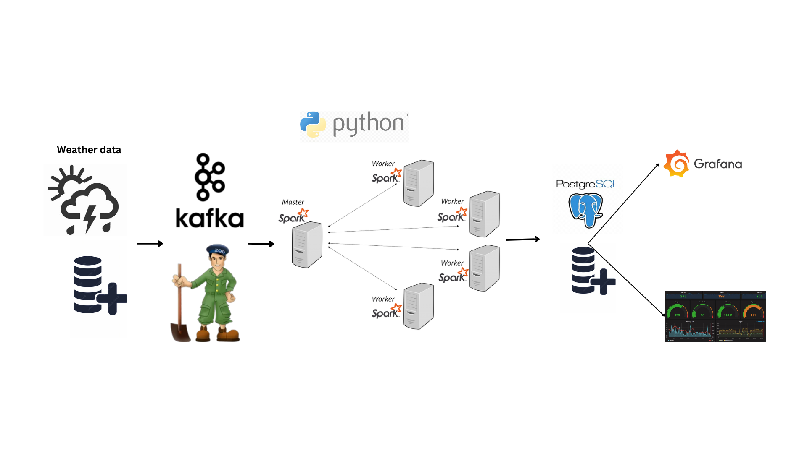

# Realtime Data Streaming Project using kafka, pyspark, postgresql,grafana

This project demonstrates an end-to-end data engineering pipeline for real-time data streaming using Apache Kafka and Apache Spark. The pipeline ingests data from various sources, processes it in real-time, and stores the results in PostgreSQL for further analysis and visualization using Grafana.

## Table of Contents

- [Project Overview](#project-overview)
- [Architecture](#architecture)
- [Components](#components)
- [Setup and Installation](#setup-and-installation)
- [Usage](#usage)
- [Contributing](#contributing)
- [License](#license)

## Project Overview

The primary goal of this project is to create a scalable and efficient data pipeline capable of handling real-time data streams. This is achieved through the integration of Apache Kafka for data ingestion and Apache Spark for real-time data processing. The processed data is stored in PostgreSQL, and Grafana is used for visualization and analysis. The project uses data from `weatherhistory.csv` and includes components written in Python.

## Architecture



The architecture of the project consists of the following components:

1. **Data Source**: Simulated data sources generating real-time data streams, including data from `weatherhistory.csv`.
2. **Apache Kafka**: A distributed streaming platform used for building real-time data pipelines and streaming applications.
3. **Apache Spark**: A unified analytics engine for large-scale data processing, used here for real-time data processing.
4. **PostgreSQL**: A relational database used as the data sink to store processed data.
5. **Grafana**: A platform for monitoring and observability, used here for visualization and analysis of the data stored in PostgreSQL.
6. **Python**: Used for scripting and data manipulation.

## Components

### Data Source
- Simulated data sources are used to generate real-time data streams for this project, including data from `weatherhistory.csv`.

### Apache Kafka
- Kafka is used to ingest data from the sources and acts as a buffer to handle the stream of incoming data.

### Apache Spark
- Spark processes the data in real-time, performing necessary transformations and aggregations.

### PostgreSQL
- The processed data is stored in PostgreSQL for persistent storage and querying.

### Grafana
- Grafana is used for visualization and analysis of the data stored in PostgreSQL.

### Python
- Python scripts are used for data generation, manipulation, and interaction with the pipeline.

## Setup and Installation

### Prerequisites

- Docker
- Docker Compose

### Steps

1. **Clone the repository**

```bash
   git clone https://github.com/abhayadevms/Realtime-Data-Streaming-End-To-End-Data-Engineering-Project.git
   cd Realtime-Data-Streaming-End-To-End-Data-Engineering-Project
```
#### Start the services

```bash
docker-compose up
```

#### run python Scripts
```bash
python main.py
```
#### run pyspark script

```bash
docker exec -it realtime-data-streaming-end-to-end-data-engineering-project-spark-master-1 \
    /opt/bitnami/spark/bin/spark-submit \
    --master spark://spark-master:7077 \
    --packages org.apache.spark:spark-sql-kafka-0-10_2.12:3.5.1,org.postgresql:postgresql:42.2.18 \
    spark-worker.py
```
### grafana  output 


